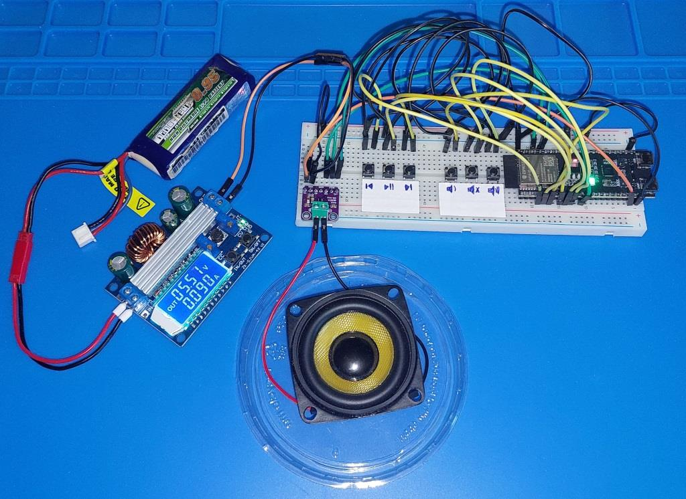
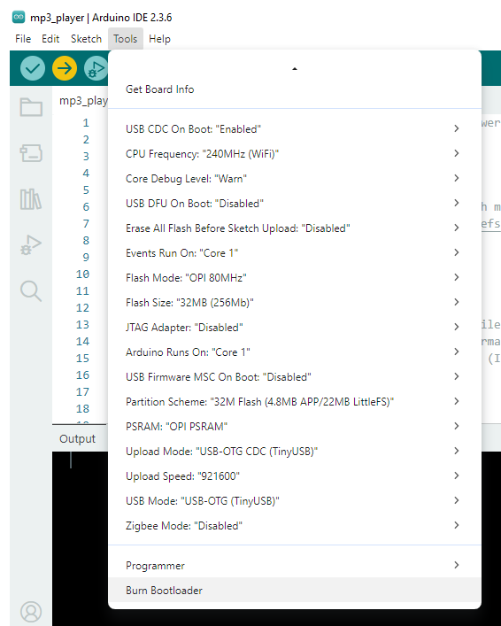

# ESP32-S3-WROOM-2_Internal_Flash_MP3_Player
An MP3 player based on the ESP32-S3-WROOM-2 that plays music stored in its internal flash.

## Youtube
You can see a small video about this project at:

## Features
- Plays MP3 files directly from internal flash memory (limited size, only few musics...)  
- Uses the ESP32-S3’s built-in USB and I²S peripherals  
- Simple control using buttons (play, pause, next, decrease volume, mute and increase volume)  
- Compact and standalone design — no SD card required  

## Hardware
- ESP32-S3-WROOM-2 module
- 6 buttons  
- MAX98357as a I²S amplifier
- 3W speaker (limited by the amplifier)
- A lot of jumper wires :)

## How to Use
1. Flash the firmware to your ESP32-S3 board, according to the configurations below.

3. Upload your MP3 files to the internal flash using the following tool by earlephilhower:
https://github.com/earlephilhower/arduino-littlefs-upload?tab=readme-ov-file

4. Connect via serial or USB to see messages from the player, if you want to.

## License
No license
